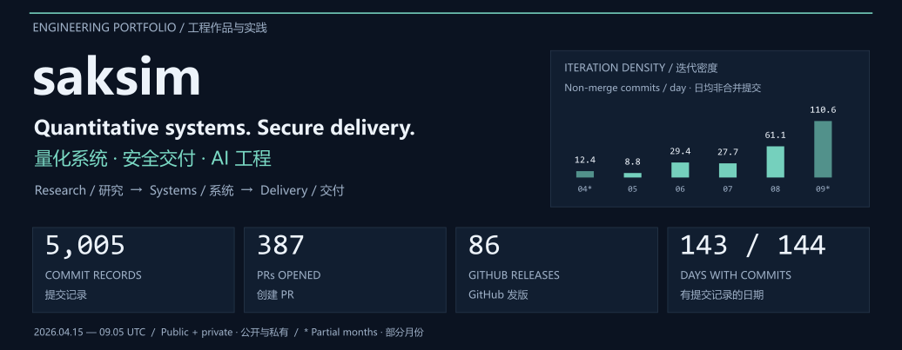
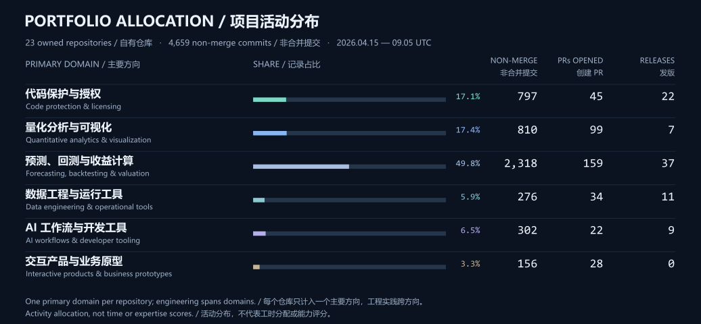
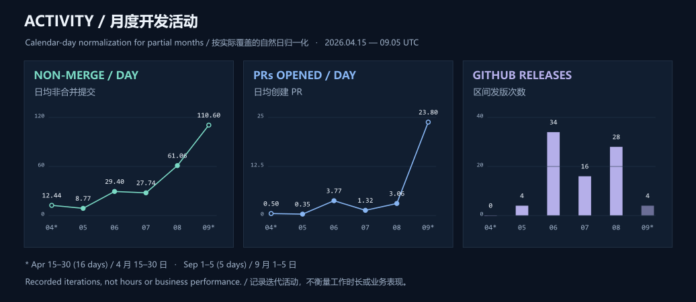

  

  <a href="mailto:wh13624@my.bristol.ac.uk?subject=Project%20collaboration%20%7C%20GitHub">Discuss a project · 项目交流</a>
  &nbsp; / &nbsp;
  <a href="#what-i-build">Portfolio · 能力与项目</a>
  &nbsp; / &nbsp;
  <a href="#activity">Activity data · 开发数据</a>

**Quantitative systems · Code protection · Data engineering · AI workflows** 
**量化系统 · 代码保护 · 数据工程 · AI 工作流**

**23** active owned repositories / 活跃自有仓库 · **95.2%** of commits private-only / 提交仅私有可见

## 01 / What I build · 能力与项目

| Domain / 方向 | Scope & selected work / 能力与代表项目 | Non-merge / Releases 非合并提交 / 发版 |
| --- | --- | ---: |
| **Code protection** 加密解密与授权 | Encrypt / restore · Protected packages · License renewal 加密恢复 · 制品保护 · 授权续期 Private tools / 私有工具 | **797 / 22** |
| **Quantitative visualization** 量化分析与可视化 | Forecasts · Risk views · Backtests · Traceable runs 预测 · 风险视图 · 回测 · 运行追溯 Private analytical terminal / 私有量化终端 | **810 / 7** |
| **Forecasting & valuation** 预测、回测与收益计算 | Forecasting · Strategies · Revenue reconciliation 预测算法 · 策略 · 收益核对 Private refactoring / 私有项目精简：**3,313 → 1,112 files / 文件**，**13 capabilities retained / 保留核心能力** | **2,318 / 37** |
| **Data engineering & delivery** 数据工程与工程化交付 | MySQL / FTP · Checkpoints · Offline & legacy support 增量同步 · 检查点 · 离线安装与旧环境兼容 Private pipelines / 私有流水线 | **276 / 11** |
| **AI workflows & tooling** AI 工作流与开发工具 | [Prompt Workflow](https://github.com/saksim/prompt_workflow) **v1.0.0** [Omni Skill Pipeline](https://github.com/saksim/omni_skill_pipeline) **7 internal releases / 内部版本** [Python assistant / 编程助手](https://github.com/saksim/claude-code-python) · [Code Abyss](https://github.com/saksim/code-abyss) contributions / 贡献 Private gateway / 私有网关 | **302 / 9** |
| **Interactive products** 交互产品与业务原型 | Legal workbench · Shared spaces · Private AI 法律工作台 · 双人空间 · 私人 AI [Law Helper](https://github.com/saksim/law_helper/tree/dev) **prototype / 原型** · Private products / 私有产品 | **156 / 0** |

Counts cover **2026-04-15—2026-09-05 UTC**; releases include internal and prerelease versions. / 统计区间同下，发版包含内部版本及预发布。

Activity allocation · 查看活动分布

Each repository has one primary domain; engineering spans domains. Counts include my fork contributions, not upstream work. / 每个仓库只归入一个主要方向，工程实践跨方向；fork 只计本人贡献，不计上游成果。

## 02 / Development activity · 开发活动

**2026-04-15 — 2026-09-05 · UTC · 144 calendar days / 144 个自然日**

| Commit records / 提交记录 | Non-merge / 非合并提交 | PRs opened / merged · 创建 / 合并 | GitHub Releases / 发版 | Days with commits / 有提交天数 |
| :---: | :---: | :---: | :---: | :---: |
| **5,005** | **4,659** | **387 / 335** | **86** | **143 / 144** |

  

Monthly ledger & methodology · 月度明细与统计口径

| Period / 区间 | Days / 天数 | Non-merge / 非合并提交 | Per day / 日均 | PRs opened / merged · 创建 / 合并 | Releases / 发版 |
| --- | ---: | ---: | ---: | ---: | ---: |
| Apr 15–30 / 4 月 15–30 日 | 16 | 199 | 12.44 | 8 / 4 | 0 |
| May / 5 月 | 31 | 272 | 8.77 | 11 / 8 | 4 |
| Jun / 6 月 | 30 | 882 | 29.40 | 113 / 106 | 34 |
| Jul / 7 月 | 31 | 860 | 27.74 | 41 / 42 | 16 |
| Aug / 8 月 | 31 | 1,893 | 61.06 | 95 / 59 | 28 |
| Sep 1–5 / 9 月 1–5 日 | 5 | 553 | 110.60 | 119 / 116 | 4 |
| **Total / 合计** | **144** | **4,659** | **32.35** | **387 / 335** | **86** |

- **Coverage / 范围：** Accessible public and private repositories; my commits in default branches, other branches and recoverable PR histories, deduplicated by full SHA and grouped by UTC committer date. / 覆盖可访问的公开与私有仓库，统计本人在默认分支、其他分支及可恢复 PR 历史中的提交，按完整 SHA 去重、UTC committer date 分月。
- **Counting / 计数：** 5,005 includes 346 merge commits. Nine further non-merge records share author, author date, message and tree snapshot; SHA counting retains them. PR events use their respective dates; 335 merges include two PRs opened before the window. / 5,005 条含 346 条合并提交；另有 9 条非合并记录的作者、作者时间、消息与内容快照相同，按 SHA 仍分别保留。PR 按各自事件日期计数，335 个合并含 2 个区间前创建的 PR。
- **Allocation / 归类：** Each owned repository has one primary domain. Shared fork/upstream SHAs count once; the upstream PR belongs to AI tooling. Categories represent activity, not expertise scores or time allocation. / 每个自有仓库归入一个主要方向，fork 与上游共享 SHA 只计一次，上游 PR 归入 AI 工具方向；分类反映活动，不是能力评分或工时分配。
- **Interpretation / 解读：** April and September are partial months. August includes over 700 micro-iterations later squashed into one integration commit. Releases include ten GitHub prereleases and internal versions. Activity does not measure hours, independent features, production deployments, forecast accuracy or investment returns. / 4 月和 9 月为部分月份；8 月含后来压缩为一个集成提交的 700 多次微迭代。Release 含 10 个 GitHub 预发布及内部版本。活动量不等于工时、独立功能、生产部署、预测准确率或投资收益。

## 03 / How I work with AI · AI 协作方法

| Stage / 阶段 | Control / 控制点 |
| --- | --- |
| **01 Define / 定义** | Scope · Contracts · Acceptance / 范围 · 契约 · 验收 |
| **02 Implement / 实现** | Bounded tasks · Branches · PRs / 任务边界 · 分支 · 评审 |
| **03 Verify / 验证** | Regression · Integration · Target environment / 回归 · 集成 · 目标环境 |
| **04 Deliver / 交付** | Version · Installation evidence · Rollback / 版本 · 安装证据 · 回滚 |

| Observable signal / 可观察协作记录 | Count / 数量 | Share / 对应记录占比 |
| --- | ---: | ---: |
| Codex self-labeled non-merge commits / 自标记非合并提交 | **2,575 / 4,659** | **55.3%** |
| codex-branch PRs / codex 分支 PR | **156 / 387** | **40.3%** |
| Codex connector PRs / 连接器创建 PR | **61 / 387** | **15.8%** |

Overlapping workflow signals; not usage hours or generated-code share. / 信号可重叠，不代表使用时长或生成代码占比。

## 04 / Engineering toolkit · 技术与工程实践

| Layer / 层次 | Tools and practices / 技术与实践 |
| --- | --- |
| Research / 研究 | Python · Time series / 时间序列 · Backtesting / 回测 |
| Data & interfaces / 数据与接口 | SQL / MySQL · TypeScript · FastAPI / Django |
| Protection & delivery / 保护与交付 | Ed25519 · wheel · `.pyd` / `.so` · Windows / Linux |
| Quality / 质量 | Git / PR · Regression / 回归 · Reproducibility / 复现 · Rollback / 回滚 |

## 05 / Let's discuss a project · 一起聊项目

**Open to projects & collaboration / 欢迎项目交流与合作。**

**Email / 邮箱：[wh13624@my.bristol.ac.uk](mailto:wh13624@my.bristol.ac.uk?subject=Project%20collaboration%20%7C%20GitHub)**

| Goal / 目标 | Inputs / 现状 | Deliverable / 交付 | Constraints / 约束 |
| --- | --- | --- | --- |
| Problem & users 问题与用户 | Data & code 数据与代码 | Output & acceptance 成果与验收 | Environment & timeline 环境与时间 |

  <b>Define the problem. Inspect the evidence. Deliver the system.</b> 
  定义问题，核验证据，完成交付。  
  Fixed activity snapshot / 固定活动快照：2026-04-15 — 2026-09-05 UTC · <a href="https://github.com/saksim/github_saksim/blob/main/README.md">README source / 维护源文件</a>

