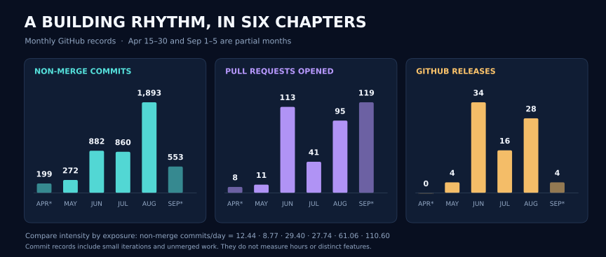

  

  <a href="mailto:wh13624@my.bristol.ac.uk?subject=Project%20collaboration%20%7C%20GitHub">Discuss a project · 项目交流</a>
  &nbsp; / &nbsp;
  <a href="#what-i-build">Portfolio · 能力与项目</a>
  &nbsp; / &nbsp;
  <a href="#activity">Activity data · 开发数据</a>

I build **quantitative research tools, analytical interfaces, protected Python software and data systems**. My work connects models and business rules with usable interfaces, reproducible execution and software delivery. Energy markets are a substantial application domain; the portfolio also spans code protection, licensing, AI tooling and interactive products.

我开发**量化研究工具、分析可视化界面、受保护的 Python 软件与数据系统**，把模型和业务规则接到可用的界面、可复现的运行过程与软件交付中。电力市场是重要的应用领域，同时也持续投入代码保护、软件授权、AI 工具链和交互产品。

**23 active owned repositories / 23 个活跃自有仓库。** In this fixed observation window, **95.2% of commit records are visible only in private repositories**. The portfolio below combines private project summaries with directly accessible public work. / 固定观察期内，**95.2% 的提交仅在私有仓库可见**；以下结合私有项目成果摘要与可直接访问的公开作品介绍能力。

## 01 / What I build · 能力与项目

  

Each repository is assigned to one primary domain for counting; engineering practices span all six. / 统计时每个仓库只归入一个主要方向，工程化实践贯穿六个方向。

### A / Code protection, encryption & licensing · 代码保护、加密解密与授权

**Private projects / 私有项目：Python protection and encrypted delivery tools; licensing and delivery tooling. / Python 代码保护与加密交付工具、软件授权与交付工具包。**

- **Build / 实现：** Content encryption and restore verification, delayed runtime decryption, protected wheel and `.pyd` / `.so` delivery, signed licenses, renewal and revocation. / 内容加密与恢复验证、运行时延迟解密、受保护 wheel 与原生模块交付，以及许可证签名、续期和吊销。
- **Solve / 解决：** Preserve import and API behavior while increasing static reverse-engineering cost; separate license issuance from customer installation and use. / 在保持导入与 API 行为的前提下提高静态逆向成本，将许可证签发与客户安装使用分离。
- **Evidence / 成果：** **2 repositories · 797 non-merge commits · 22 Releases.** A release path enables license renewal without rebuilding native artifacts, with source / wheel / Drop-In compatibility checks. / **2 个仓库、797 条非合并提交、22 次 Release**；一条发布路径实现无需重建原生制品的许可证续期，并核验源码、wheel 与 Drop-In 的兼容性。

### B / Quantitative analytics & visualization · 量化分析与可视化

**Private project / 私有项目：An analytical terminal and a workspace for reports, runs and artifacts. / 量化分析终端与报告、运行及制品工作区。**

- **Build / 实现：** Price and spread analysis, quantile forecasts, 15-minute risk views, strategy backtesting and traceable reports. / 价格与价差分析、分位数预测、15 分钟风险视图、策略回测与可追溯报告。
- **Solve / 解决：** Link a displayed result to its input snapshot, decision time, model version and computation run; integrate access control and artifact storage. / 将展示结果关联到输入快照、决策时点、模型版本与计算运行，并接入访问权限与制品存储。
- **Evidence / 成果：** **810 non-merge commits · 99 PRs opened · 7 Releases.** The terminal evolved toward persistent Run / Artifact records and S3-backed result integration. / **810 条非合并提交、99 个创建 PR、7 次 Release**；持续接入持久化运行记录、制品关联与 S3 结果存储。

### C / Forecasting, backtesting & valuation · 预测、回测与收益计算

**Private projects / 私有项目：Forecasting libraries, strategy engines, storage valuation and revenue reconciliation tools. / 预测算法库、策略引擎、储能测算与收益核对工具。**

- **Build / 实现：** Time-series forecasts, price-spread signals, configurable forecast horizons, strategy backtests and auditable revenue calculations. / 时间序列预测、价差信号、可配置预测范围、策略回测与可核对的收益计算。
- **Solve / 解决：** Make research callable from applications, with explicit units, date boundaries, data contracts, runtime compatibility and rollback paths. / 将研究代码变成业务可调用组件，明确单位、日期边界、数据契约、环境兼容性与回滚路径。
- **Evidence / 成果：** **8 repositories · 2,318 non-merge commits · 37 Releases.** One documented consolidation reduced tracked files **3,313 → 1,112**, while checking retention of **13 core capabilities**. / **8 个仓库、2,318 条非合并提交、37 次 Release**；一次有记录的精简将跟踪文件从 **3,313 减至 1,112**，同时核验保留 **13 项核心能力**。

### D / Data engineering & software delivery · 数据工程与工程化交付

**Private projects / 私有项目：Data synchronization, collection and reusable operational utilities. / 数据同步、数据采集与可复用运行工具。**

- **Build / 实现：** Streaming MySQL extraction, keyset pagination, compound keys, FTP / FTPS transfers, checkpoints, data contracts and recovery reports. / MySQL 流式抽取、键集分页、联合主键、FTP / FTPS 传输、检查点、数据契约与恢复报告。
- **Solve / 解决：** Replace one-off scripts with configurable, recoverable pipelines. Across the portfolio, delivery also covers isolated dependencies, offline installation, legacy Python support and install verification. / 将一次性脚本改造成可配置、可恢复的流水线；各项目的交付工作还覆盖依赖隔离、离线安装、旧版 Python 支持与安装验证。
- **Evidence / 成果：** **3 repositories · 276 non-merge commits · 11 Releases** in this primary domain, including versioned recovery and multi-task synchronization workflows. / 该主要方向有 **3 个仓库、276 条非合并提交、11 次 Release**，持续完善恢复流程与多任务同步路径。

### E / AI workflows & developer tooling · AI 工作流与开发工具

**Public and private work / 公开与私有成果：6 owned repositories, plus an upstream contribution / 6 个自有仓库，另有上游贡献。**

| Project / 项目 | Contribution and stage / 解决的问题与阶段 |
| --- | --- |
| [Prompt Workflow](https://github.com/saksim/prompt_workflow) | Scoped tasks and implementation prompts from ambiguous requests; API, CLI, preferences and explicit history import. **v1.0.0 released.** / 将模糊需求转为有范围的任务与实施 Prompt，提供 API、CLI、偏好和显式历史导入；**已发布 v1.0.0**。 |
| [Omni Skill Pipeline](https://github.com/saksim/omni_skill_pipeline) | Multimodal evidence → Skill artifacts, graphs, review records and installable packages. **7 internal releases.** / 多模态证据转为 Skill 工件、图结构、审核记录与安装包；**7 个内部验证版本**。 |
| [Python coding assistant / Python 编程助手](https://github.com/saksim/claude-code-python) | Implementation and iteration on a Python coding-assistant project. / Python 编程助手项目的实现与迭代。 |
| [Code Abyss contributions / 工具贡献](https://github.com/saksim/code-abyss) | Developer-personalization tooling; the upstream PR remained unmerged at the cutoff. / 开发者个性化工具改进；截止时上游 PR 尚未合并。 |
| Private AI gateway / 私有 AI 网关 | Gateway, interface and product-workflow iteration alongside reusable prompt tooling. / 与 Prompt 工具并行推进的网关、界面及产品流程迭代。 |

**302 non-merge commits · 22 PRs opened · 9 Releases / 302 条非合并提交、22 个创建 PR、9 次 Release。** Counts include my contributions in forks, rather than attributing upstream work to me. / 统计只计本人在 fork 中的贡献，不将上游成果归为本人工作。

### F / Interactive products & business prototypes · 交互产品与业务原型

- **[Law Helper](https://github.com/saksim/law_helper/tree/dev), public prototype / 公开原型：** A legal-team workspace for document parsing, entity identification, lead reports, reminders, access control and audit trails. / 面向律师团队的工作台，探索材料解析、主体识别、线索报告、提醒、权限与审计。
- **Private products / 私有产品：** A two-person space with shared memories, account boundaries, private AI history and consent-based shared rooms; additional presentation work for a trading product. / 双人互动空间，覆盖共享回忆、账号边界、私人 AI 历史与双方同意的共同房间；另有交易产品的展示工作。
- **Evidence / 成果：** **3 repositories · 156 non-merge commits · 28 PRs opened.** Prototype and development work, with no GitHub Releases in this window. / **3 个仓库、156 条非合并提交、28 个创建 PR**；本区间按原型与开发工作介绍，尚无 GitHub Release。

## 02 / Development activity · 开发活动

**2026-04-15 — 2026-09-05 · UTC · 144 calendar days / 144 个自然日**

| Commit records / 提交记录 | Non-merge / 非合并提交 | PRs opened / merged · 创建 / 合并 | GitHub Releases / 发版 | Days with commits / 有提交天数 |
| :---: | :---: | :---: | :---: | :---: |
| **5,005** | **4,659** | **387 / 335** | **86** | **143 / 144** |

  

Monthly ledger & methodology · 月度明细与统计口径

| Period / 区间 | Days / 天数 | Non-merge / 非合并提交 | Per day / 日均 | PRs opened / merged · 创建 / 合并 | Releases / 发版 |
| --- | ---: | ---: | ---: | ---: | ---: |
| Apr 15–30 / 4 月 15–30 日 | 16 | 199 | 12.44 | 8 / 4 | 0 |
| May / 5 月 | 31 | 272 | 8.77 | 11 / 8 | 4 |
| Jun / 6 月 | 30 | 882 | 29.40 | 113 / 106 | 34 |
| Jul / 7 月 | 31 | 860 | 27.74 | 41 / 42 | 16 |
| Aug / 8 月 | 31 | 1,893 | 61.06 | 95 / 59 | 28 |
| Sep 1–5 / 9 月 1–5 日 | 5 | 553 | 110.60 | 119 / 116 | 4 |
| **Total / 合计** | **144** | **4,659** | **32.35** | **387 / 335** | **86** |

- **Coverage / 范围：** Accessible public and private repositories; my commits in default branches, other branches and recoverable PR histories, deduplicated by full SHA and grouped by UTC committer date. / 覆盖可访问的公开与私有仓库，统计本人在默认分支、其他分支及可恢复 PR 历史中的提交，按完整 SHA 去重、UTC committer date 分月。
- **Counting / 计数：** 5,005 includes 346 merge commits. Nine further non-merge records share author, author date, message and tree snapshot; SHA counting retains them. PR events use their respective dates; 335 merges include two PRs opened before the window. / 5,005 条含 346 条合并提交；另有 9 条非合并记录的作者、作者时间、消息与内容快照相同，按 SHA 仍分别保留。PR 按各自事件日期计数，335 个合并含 2 个区间前创建的 PR。
- **Allocation / 归类：** Each owned repository has one primary domain. Shared fork/upstream SHAs count once; the upstream PR belongs to AI tooling. Categories represent activity, not expertise scores or time allocation. / 每个自有仓库归入一个主要方向，fork 与上游共享 SHA 只计一次，上游 PR 归入 AI 工具方向；分类反映活动，不是能力评分或工时分配。
- **Interpretation / 解读：** April and September are partial months. August includes over 700 micro-iterations later squashed into one integration commit. Releases include ten GitHub prereleases and internal versions. Activity does not measure hours, independent features, production deployments, forecast accuracy or investment returns. / 4 月和 9 月为部分月份；8 月含后来压缩为一个集成提交的 700 多次微迭代。Release 含 10 个 GitHub 预发布及内部版本。活动量不等于工时、独立功能、生产部署、预测准确率或投资收益。

## 03 / How I work with AI · AI 协作方法

I use AI for task decomposition, implementation, test assistance and review repair, organizing collaboration around **explicit contracts, verifiable evidence and versioned delivery**. / 我把 AI 用于任务拆解、实现、测试辅助与评审修复，围绕**明确契约、可核验证据和版本化交付**组织协作。

| Stage / 阶段 | Working approach / 协作方式 |
| --- | --- |
| **Define / 定义** | Establish the problem, inputs, constraints and acceptance criteria. / 明确问题、输入、约束和验收标准。 |
| **Structure / 组织** | Build context from repository documents and evidence; split work into bounded tasks and interfaces. / 从仓库文档与证据组织上下文，拆分有边界的任务和接口。 |
| **Implement / 实现** | Make changes reviewable through branches and PRs, with focused implementation and repair cycles. / 用分支与 PR 承载可评审改动，围绕具体任务实现与修复。 |
| **Verify / 验证** | Check behavior, integration and target-environment assumptions; distinguish executed checks from planned checks. / 核对行为、集成与目标环境假设，区分已执行验证和计划中的验证。 |
| **Deliver / 交付** | Link release notes and artifacts to versions, installation checks and recovery paths. / 将发布说明和制品关联到版本、安装检查与恢复路径。 |

| Observable signal / 可观察协作记录 | Count / 数量 | Share / 对应记录占比 |
| --- | ---: | ---: |
| Non-merge commits with a Codex self-label / 带 Codex 自标记的非合并提交 | **2,575 / 4,659** | **55.3%** |
| PRs using a codex branch name / 使用 codex 分支名的 PR | **156 / 387** | **40.3%** |
| PRs created through the Codex connector / 通过 Codex 连接器创建的 PR | **61 / 387** | **15.8%** |

These signals overlap. They describe workflow traces, not AI hours, token usage, generated-code share or measured productivity gains. / 三类信号可能重叠，描述协作留痕，不代表 AI 时长、Token 用量、生成代码占比或已测量的效率提升。

## 04 / Engineering toolkit · 技术与工程实践

| Layer / 层次 | Tools and practices / 技术与实践 |
| --- | --- |
| Research & computation / 研究与计算 | Python · time-series analysis / 时间序列分析 · forecasting / 预测 · backtesting / 回测 · revenue reconciliation / 收益核对 |
| Data & interfaces / 数据与接口 | SQL / MySQL · TypeScript · FastAPI / Django · analytical interfaces / 分析界面 · data contracts / 数据契约 |
| Protection & delivery / 保护与交付 | Ed25519 license signatures / 许可证签名 · wheel · `.pyd` / `.so` · offline installation / 离线安装 · Windows / Linux |
| Quality & operations / 质量与运行 | Git / PR workflows / 工作流 · regression checks / 回归检查 · reproducible environments / 可复现环境 · release evidence / 发布证据 · rollback / 回滚 |

## 05 / Let's discuss a project · 一起聊项目

**I welcome project discussions and collaboration** on quantitative tools and dashboards, Python protection and licensing, data pipelines, research-to-software delivery, and AI workflows. Bring a problem to define, an existing system to improve, or a product idea to explore.

**欢迎交流项目与合作机会**：量化工具与数据看板、Python 代码保护与授权、数据流水线、研究成果工程化、AI 工作流。可以从待定义的问题、需要改进的现有系统，或一个产品想法开始讨论。

**Email / 邮箱：[wh13624@my.bristol.ac.uk](mailto:wh13624@my.bristol.ac.uk?subject=Project%20collaboration%20%7C%20GitHub)**

A short project brief helps us start with the right questions. / 一份简短的项目说明，能让交流更快进入具体问题：

| Include / 建议说明 | Useful context / 关键信息 |
| --- | --- |
| **Goal / 目标** | Who will use it, and what problem should it solve? / 谁来使用，希望解决什么问题？ |
| **Starting point / 现状** | Available data, codebase, interfaces and current bottlenecks. / 已有数据、代码、接口与当前瓶颈。 |
| **Deliverable / 交付** | Expected output and how you would judge success. / 期望交付什么，以及如何判断完成。 |
| **Constraints / 约束** | Runtime, deployment, confidentiality, timeline and intended collaboration. / 运行环境、部署条件、保密要求、时间计划与合作方式。 |

  <b>Define the problem. Inspect the evidence. Deliver the system.</b> 
  定义问题，核验证据，完成交付。  
  Fixed activity snapshot / 固定活动快照：2026-04-15 — 2026-09-05 UTC · <a href="https://github.com/saksim/github_saksim/blob/main/README.md">README source / 维护源文件</a>

