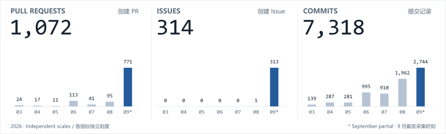

# saksim

**Quantitative systems · Python engineering** 
**量化系统 · Python 工程**

## Expertise / 擅长领域

| Domain / 领域 | Focus / 能力 | Selected work / 项目 |
| --- | --- | --- |
| **Quantitative systems** 量化系统 | Forecasting · Backtesting · Visualization 预测 · 回测 · 可视化 | Private research platforms 私有研究平台 |
| **Code protection** 代码保护 | Encryption · Native builds · Licensing 加密 · 原生构建 · 授权 | [SOEnc](https://github.com/weiyuaistudio/soenc-python-protection) |
| **Data engineering** 数据工程 | Incremental sync · Offline delivery 增量同步 · 离线交付 | Private data pipelines 私有数据流水线 |
| **AI tooling** AI 工具 | Agent workflows · Evidence workbenches 智能体工作流 · 证据工作台 | [Prompt Workflow](https://github.com/saksim/prompt_workflow) [Vibe Job Radar](https://github.com/saksim/vibe_job_radar) |

**AI workflow / AI 协作** · Define → Build → Verify → Deliver / 定义 → 构建 → 验证 → 交付

## Activity / 开发活动

2026-03-01 — 2026-09-30 08:23 UTC · Public + private / 公开 + 私有

<picture>
  <source media="(prefers-color-scheme: dark)" srcset="assets/activity-20260930-dark.svg">
  
</picture>

Monthly ledger & method / 月度数据与口径

| Month / 月份 | PRs opened / 创建 | Issues opened / 创建 | Commits / 提交 |
| --- | ---: | ---: | ---: |
| 2026-03 | 24 | 0 | 139 |
| 2026-04 | 17 | 0 | 287 |
| 2026-05 | 11 | 0 | 281 |
| 2026-06 | 113 | 0 | 995 |
| 2026-07 | 41 | 0 | 910 |
| 2026-08 | 95 | 1 | 1,962 |
| 2026-09* | 771 | 313 | 2,744 |
| **Total / 合计** | **1,072** | **314** | **7,318** |

- **Scope / 范围：** My activity in accessible personal, organization and contributed-to repositories, including private work. / 本人在可访问的个人、组织及参与贡献仓库中的活动，包含私有项目。
- **Events / 事件：** PRs and Issues count creations; Issues exclude PRs. Commits use GitHub-resolved authorship, full-SHA deduplication and UTC committer dates; merge commits included. / PR、Issue 按创建日期；Issue 不含 PR。提交按 GitHub 作者归属、完整 SHA 去重及 UTC 提交时间统计，含合并提交。
- **Coverage / 覆盖：** Default/other branches, recoverable PR histories and verified prior snapshots. *September ends at 2026-09-30 08:23:06 UTC. Activity counts are not hours or performance scores. / 默认及其他分支、可恢复 PR 历史与已核实旧快照。*9 月截至采集时刻；活动量不等于工时或绩效。

---

**Let's build / 项目合作** · [wh13624@my.bristol.ac.uk](mailto:wh13624@my.bristol.ac.uk?subject=Project%20collaboration)

Send the problem, current setup and desired outcome. / 欢迎带着问题、现状和目标交流。
